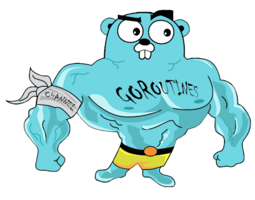

# Go



**An Agent Skill that makes your coding agent write Go like someone who has shipped it, and review Go like someone who has been paged at 3am.**

Named rules. Worked examples. Every rule traceable to a primary source.

[](https://skills.sh/)
[](SKILL.md)


[](LICENSE)

## Install

Two steps. The first installs the Skill, the second makes it always on in Go repositories.

```bash
# 1. the Skill - the full corpus, loaded on demand
npx skills add ctxr-dev/skill-golang

# 2. the Rule - routes every Go turn into the corpus
mkdir -p ~/.claude/rules
curl -fsSL https://raw.githubusercontent.com/ctxr-dev/skill-golang/main/rules/golang.md \
  -o ~/.claude/rules/golang.md
```

Restart your agent. It applies the rules on its own from then on. You can also ask directly:
*"review this file against the Go corpus."*

**Why two steps.** Skills load **on demand**: the agent reads the description and decides. Rules load
**every session**, with no decision involved. The Skill alone gives you this most of the time; the
Rule makes it the default every time. The `skills` CLI installs Skills, so it cannot place a rule
file for you.

**Updating.** Re-run both steps after each release. The Skill's `metadata.version` shows the version,
and review findings link to the corpus at that tag.

<details>
<summary>Other install options</summary>

**Global**: add `-g` to the `skills` command to install for all your projects.

**Project-level rule**: put the rule at `.claude/rules/golang.md` in your repo root, or paste its
contents into `CLAUDE.md`.

**Other agents**: Codex, omp, Cursor, Copilot, Gemini CLI, Windsurf and OpenCode each get a
ready-made block in the next section.

**Windows PowerShell**: use `$env:USERPROFILE\.claude\rules` in place of `~/.claude/rules`.

**Track the repo instead of copying**: `ln -sf "$PWD/rules/golang.md" ~/.claude/rules/golang.md`

**Try it without installing**: `npx skills use ctxr-dev/skill-golang | claude`

**Inspect first**: `npx skills add ctxr-dev/skill-golang --list`

</details>

<details>
<summary>Install the Rule in another agent: Codex, omp, Cursor, Copilot, Gemini CLI, Windsurf, OpenCode</summary>

Every block installs the same file: [`rules/golang.md`](rules/golang.md). Run the one for your agent
once. All of them are user-global unless the comment says project.

**Agents with a rules directory.** Each needs its own frontmatter to mark the rule as always-on, so
the block writes that frontmatter and then appends the rule body.

omp:

```bash
mkdir -p ~/.omp/agent/rules
{ printf -- '---\nalwaysApply: true\n---\n\n'
  curl -fsSL https://raw.githubusercontent.com/ctxr-dev/skill-golang/main/rules/golang.md
} > ~/.omp/agent/rules/golang.md
```

`alwaysApply: true` is not optional here. omp discovers a rule file that has no `alwaysApply`, no
`description` and no trigger condition, then drops it. The file would sit on disk doing nothing. For
one project only, write to `.omp/rules/golang.md` instead.

Cursor (project):

```bash
mkdir -p .cursor/rules
{ printf -- '---\ndescription: Go practice, routing into the corpus\nglobs: **/*.go\nalwaysApply: true\n---\n\n'
  curl -fsSL https://raw.githubusercontent.com/ctxr-dev/skill-golang/main/rules/golang.md
} > .cursor/rules/golang.mdc
```

Windsurf (project):

```bash
mkdir -p .windsurf/rules
{ printf -- '---\ntrigger: always_on\n---\n\n'
  curl -fsSL https://raw.githubusercontent.com/ctxr-dev/skill-golang/main/rules/golang.md
} > .windsurf/rules/golang.md
```

**Agents that read one Markdown context file.** Same block for all of them. Set `FILE` from the
table, then run it. It is safe to re-run: the marker pair is deleted and rewritten, so you never get
two copies.

```bash
FILE=~/.codex/AGENTS.md            # pick your path from the table below

mkdir -p "$(dirname "$FILE")" && touch "$FILE"
sed -i.bak '/<!-- BEGIN skill-golang -->/,/<!-- END skill-golang -->/d' "$FILE" && rm -f "$FILE.bak"
{ echo '<!-- BEGIN skill-golang -->'
  curl -fsSL https://raw.githubusercontent.com/ctxr-dev/skill-golang/main/rules/golang.md
  echo '<!-- END skill-golang -->'
} >> "$FILE"
```

| Agent | `FILE` | Scope |
|---|---|---|
| Codex CLI | `~/.codex/AGENTS.md` | user |
| Gemini CLI | `~/.gemini/GEMINI.md` | user |
| OpenCode | `~/.config/opencode/AGENTS.md` | user |
| GitHub Copilot | `.github/copilot-instructions.md` | project |
| Any other agent that reads `AGENTS.md` | `AGENTS.md` | project |

Codex inlines the body because it does not expand `@path` imports. Gemini CLI and omp do expand them,
so you can point at a clone instead of copying, with `@~/src/skill-golang/rules/golang.md` on its own
line.

</details>

---

## What it does

Two modes, one corpus.

**Write mode.** The agent opens the rules for what it is doing — naming, errors, goroutines, tests —
and applies them as it types. It does not read the whole corpus.

**Review mode.** The agent produces a report and never edits the code under review. Every finding
carries a severity, a location, a link to the rule that justifies it, what is wrong and the fix. The
report ends with an explicit list of what was **not** reviewed, and lands in
`~/.skill-golang/<date>/<time>/<slug>/` — never inside the repository under review.

## It defers to your standards

If your organisation already has a Go standard, that standard wins — **one topic at a time**.

| Rung | Signal |
|---|---|
| 0 | A rule already loaded in the session's context |
| 1 | `AGENTS.md`, `CLAUDE.md`, `.cursor/rules/`, `.github/copilot-instructions.md` |
| 2 | A loaded skill that declares it supersedes Go guidance |
| 3 | A Go standards document in the repo, or its `.golangci.yml` |
| 4 | This corpus |

An `AGENTS.md` that fixes struct field ordering wins on struct field ordering. The other 85 rules
still apply in the same file. The agent says which rung it took and on what.

## The corpus

86 rules in 20 files. Each rule is one `##` section: the rule, the reason, a good example, a bad one
where it teaches something, what catches a violation, and its sources.

| File | Rules | Covers |
|---|---|---|
| [`corpus/onboarding.md`](corpus/onboarding.md) | 3 | Companion skills, precedence, the two modes |
| [`corpus/docs.md`](corpus/docs.md) | 4 | Doc comments required, every other comment banned |
| [`corpus/style.md`](corpus/style.md) | 4 | Happy path, size gates, declarations, signatures |
| [`corpus/naming.md`](corpus/naming.md) | 4 | MixedCaps, initialisms, packages, receivers |
| [`corpus/errors.md`](corpus/errors.md) | 4 | Wrap or log, sentinel or typed, string form |
| [`corpus/safety.md`](corpus/safety.md) | 6 | Panics, nil, maps, append aliasing, assertions |
| [`corpus/concurrency.md`](corpus/concurrency.md) | 5 | Goroutine lifetime, channels, bounded fan-out |
| [`corpus/context.md`](corpus/context.md) | 4 | First parameter, cancellation, values |
| [`corpus/interfaces.md`](corpus/interfaces.md) | 6 | Consumer-side interfaces, receivers, wiring |
| [`corpus/layout.md`](corpus/layout.md) | 3 | Progressive layout, domain packages, exports |
| [`corpus/testing.md`](corpus/testing.md) | 7 | Red first, tables, parallel, doubles, race |
| [`corpus/security.md`](corpus/security.md) | 5 | SQL, secrets, templates, config, vulnerabilities |
| [`corpus/performance.md`](corpus/performance.md) | 5 | Measure first, capacity, struct shape, benchmarks |
| [`corpus/observability.md`](corpus/observability.md) | 4 | `log/slog`, levels, fan-out, traces and metrics |
| [`corpus/api.md`](corpus/api.md) | 4 | Transport choice, clients, servers, RPC |
| [`corpus/data.md`](corpus/data.md) | 3 | Queries and pooling, transactions, migrations |
| [`corpus/dependencies.md`](corpus/dependencies.md) | 4 | Tiers, greenfield questions, `go.mod`, a dated snapshot |
| [`corpus/tooling.md`](corpus/tooling.md) | 4 | golangci-lint, `go fix`, `gopls`, CI gates |
| [`corpus/modernization.md`](corpus/modernization.md) | 4 | Version baseline, `slices`/`maps`/`cmp`, 1.26 features |
| [`corpus/review.md`](corpus/review.md) | 3 | Finding contract, scope and order, citations |

[`references/corpus-index.md`](references/corpus-index.md) lists all 86 with their priority and the
linter that catches each one.
[`references/ecosystem-snapshot.md`](references/ecosystem-snapshot.md) holds the measured library
table, kept out of the corpus so opening `corpus/dependencies.md` for any other rule does not load
it.

**Priority.** P0 governs on contradiction — 17 of them. P1 is a strong default. P2 is contextual.

## Two companion skills

Neither is required. Both change what this one does when they are installed.

| Skill | What changes |
|---|---|
| [`no-comments`](https://github.com/ctxr-dev/no-comments) | The comment ban is enforced in every language, not just Go |
| [`simple-language`](https://github.com/ctxr-dev/simple-language) | Findings and doc comments are written in plain words |

This skill makes **one declared exception** to `no-comments`: a doc comment on an exported Go
identifier or a package stays, because `go/doc` reads it and pkg.go.dev renders it, so it is API
surface rather than prose. Every other comment goes.

## Go versions

The corpus targets **Go 1.25 and Go 1.26**. A rule needing the newer release carries `since: 1.26`
and shows the 1.25 form beside it.

Examples were checked on **go1.25.11**: every standard-library example is gofmt-clean and compiles.
Examples on a `since: 1.26` rule were checked against the release notes by hand, and those rules say
so.

## Maintaining it

```bash
node --test
```

Four zero-dependency `node:test` suites, no `package.json`. They check the corpus structure, that
every rule links resolve, that every Go example is gofmt-clean and compiles, that every enabled
linter maps to a named rule, and that a published tree still carries the corpus.

## License

MIT. See [LICENSE](LICENSE).
